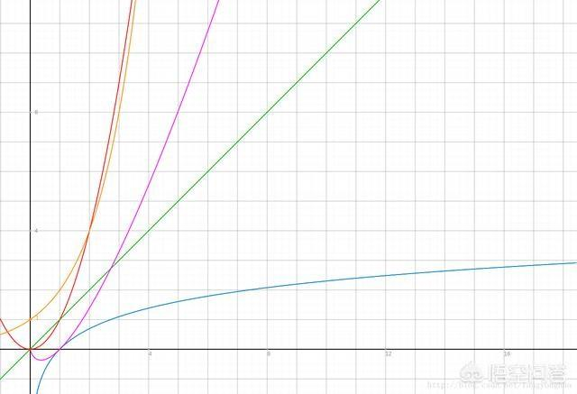

这次的重温对象是二叉树，看了一下几编文章。

    非递归建立二叉树
    https://www.cnblogs.com/linzhehuang/p/6822847.html

    轻松搞定面试中的二叉树题目
    https://blog.csdn.net/luckyxiaoqiang/article/details/7518888

    数据库为什么要使用二叉树？
    http://www.360doc.com/content/18/0416/07/11935121_745993713.shtml

	

#### 图形讲解

    二叉树主要是用搜索的

上图的X轴表示数据（或者数据库的数据），Y轴表示搜索次数（比较次数）。

蓝色的线表示 log2(n)。

Y轴值越大，表示搜到结果的需要的次数越多。

#### 数据库大小和搜索的关系

    查找效率，数学表达和大O表示法
    顺序查找:y＝x/2; O(N);
    二叉树查找:y＝2^N;O(log2(n))

假设数据库有1 000 000 000（10亿）数据，数据库文件大小为10G，为了搜索一条数据。

假设这个数据刚好在最后一条，使用顺序查找的话，需要查找10亿/2=5亿次，计算机需要将10G的数据库文件读入内存。

使用二叉树算法搜索，需要查找log2(10亿) = 29.897352854（30次），计算机需要读取数据库文件0.000000G（很小就是了）就找到了数据。

