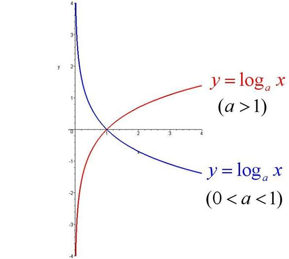
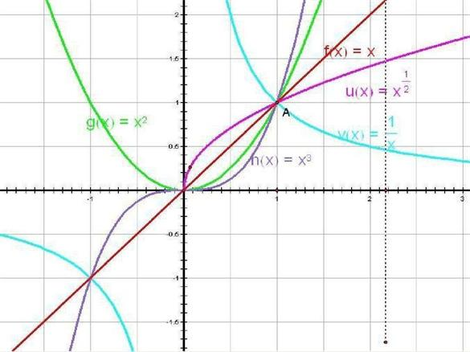
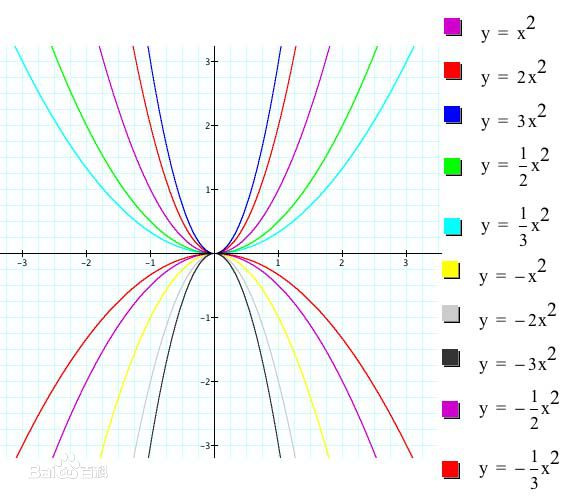
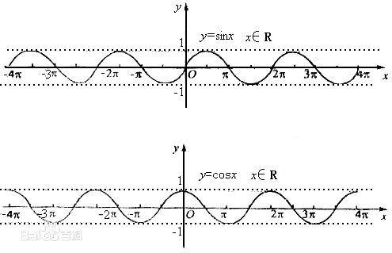

### 
算法重温

#### 常见数据结构与算法C语言实现

[Data-Structures-and-Algorithms-in-C-master](./Data-Structures-and-Algorithms-in-C-master)

-

#### 对数函数

	
	</img>

#### 幂函数

	
	</img>

#### 二次函数

	
	</img>

#### 正弦函数

	
	</img>

